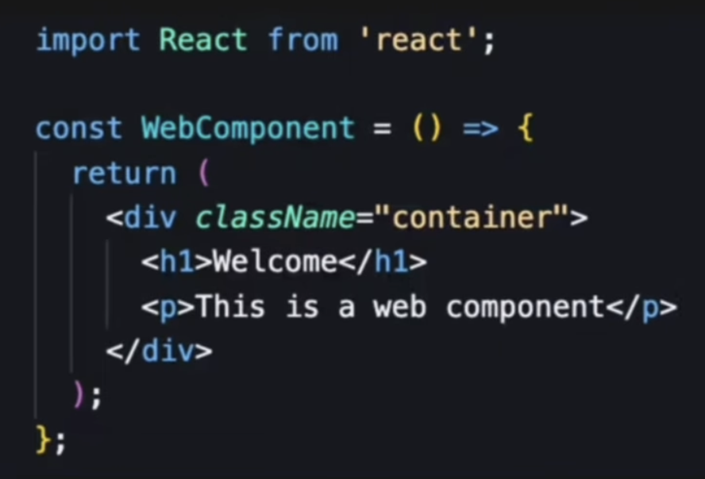
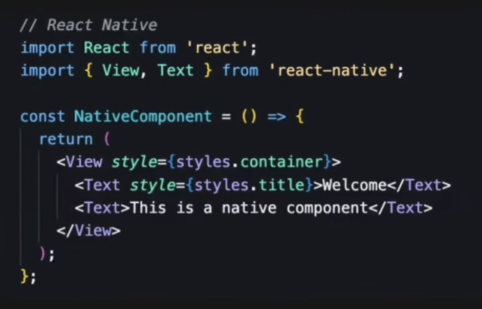
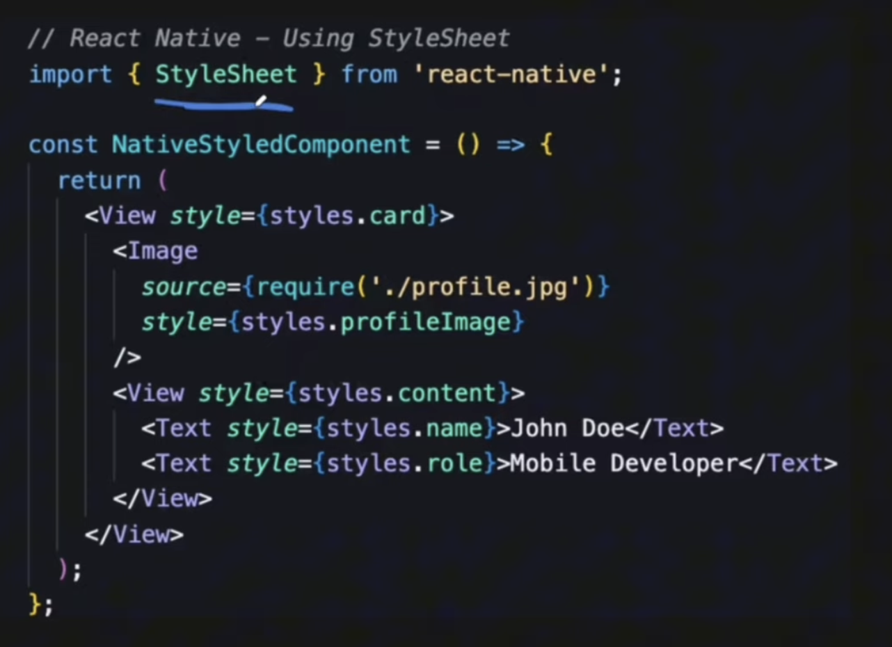
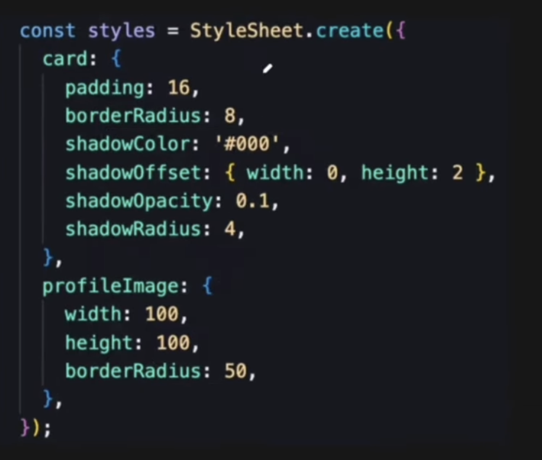

# Some Words on React Native
React Native is the framework: it lets you write UI in JavaScript/React and have it render as real native iOS/Android components instead of a web view. 
But on its own, "bare" React Native only gives you the JS-to-native bridge — it doesn't give you tooling for building, testing, or accessing native 
device stuff like camera, location, notifications, etc. You'd have to wire a lot of that up yourself, including native Xcode/Android Studio config. 

Expo is a platform/toolchain built on top of React Native that handles all that surrounding stuff for you:
- Dev experience: npx create-expo-app, instant reload, run on your phone via the Expo Go app without touching Xcode or Android Studio at all
- Pre-built native modules: camera, location, notifications, sensors, file system, etc. — as simple JS APIs, no native code needed
- Expo Router: file-based navigation (like Next.js) built on top of React Navigation
- EAS (Expo Application Services): cloud build and submission service — builds your iOS/Android binaries without you owning a Mac, and can submit straight to the App Store/Play Store
- OTA updates: push JS updates to users without a new app store release

## Comparison with React
### Component Structure
<table>
  <tr>
    <td></td>
    <td></td>
  </tr>
</table>

In react native, you don't use div or p tag like you use in react. It's different in React Native. Here, you add a View which is like a box and then whatever text you want to add there you wrap it up with 'Text'. These View and Text come from react-native.

### Stylesheet
In react, you would add styles in a separate css file and select elements with classes. But in React Native, you do it this way:
 

### Event Handling
