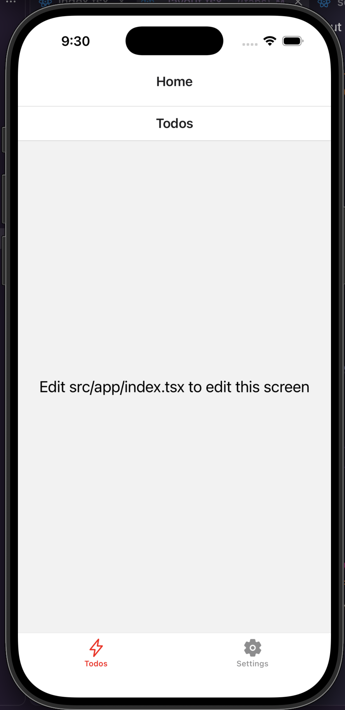

## How Navigation works

To navigate from one screen to another screen.<br>

```tsx
<View style={styles.container}>
  <Text style={styles.content}>Edit src/app/index.tsx to edit this screen</Text>
  <Link href="/about">Visit about screen</Link>
</View>
```

This will navigate to the about screen.<br>

## Stack in Layout

The reason we have the stack like navigation is we used the `Stack` component in the root layout.

```tsx
import { Stack } from "expo-router"

export default function RootLayout() {
  return <Stack />
}
```

<br>
There is a browser-tab like name above the view/window where the name of the view is written. If you want to get rid of this, add the following prop to the `Stack` component:

```tsx
<Stack screenOptions={{ headerShown: false }} />
```

The only problem it has is the view content overflows the curved edges.<br>

<br><br>

Let's say you want to have the tab title but specific to the screen and your way:

```tsx
export default function RootLayout() {
  return (
    <Stack>
      <Stack.Screen name="index" options={{ title: "Home" }} />
      <Stack.Screen name="about" options={{ title: "About" }} />
    </Stack>
  )
}
```

<br>

## Tab Navigator

A tab navigator in react native is a navigation pattern that creates a tab bar (usually at the bottom of the screen) allowing users to switch between screens. <br>

add a folder `(tabs)` in the 'app' directory. There you add what tab options you want. Then add a layout file `_layout.tsx` in that folder.<br>
Now you write each tab according to your need and logic. And `_layout.tsx` must look like the following code.<br>
The thing needs to count is the name of the `<Tabs.Screen` opening tag has to match their actual file name.

```tsx
import { Ionicons } from "@react-native-vector-icons/ionicons/static"
import { Tabs } from "expo-router"

const TabsLayout = () => {
  return (
    <Tabs
      screenOptions={{
        tabBarActiveTintColor: "red",
      }}
    >
      <Tabs.Screen
        name="index"
        options={{
          title: "Todos",
          tabBarIcon: ({ color, size }) => (
            <Ionicons name="flash-outline" size={size} color={color} />
          ),
        }}
      />
      <Tabs.Screen
        name="settings"
        options={{
          title: "Settings",
          tabBarIcon: ({ color, size }) => (
            <Ionicons name="settings" size={size} color={color} />
          ),
        }}
      />
    </Tabs>
  )
}

export default TabsLayout
```

<br>

### Ionicons

`@expo/vector-icons` package is being deprecated. Expo doesn't recommend to use this package anymore. Instead it recommends `@react-native-vector-icons/ionicons`.

## expo dev client

Generally when you run `npx expo` and then press `i`, it will open the ios simulator where it will open the expo go app. But the `expo go` app doesn't support the ionicons and there are other things that can make it feel like the `expo go` app is obsolete.<br>
The solution is to install the `expo-dev-client` package. Then if we run the `npx expo start` command, it will let you open the simulator. This is how the app will open by default when you run the simulator.<br><br>

If we don't want headers, we can get rid of that. There are two levels of headers: view level and the stack level.<br>
We can get rid of them by negating the `headerShown` property of screenOptions. It's doable both in the layout file and the tab. for example:

```tsx
<Stack screenOptions={{ headerShown: false }}>
  <Stack.Screen name="(tabs)" options={{ title: "Home" }} />
</Stack>
```

## AsyncStorage - Storage on a user's device

AsyncStorage is React Native's simple, promise-based API for persisting small bits of data on a user's device. Think of it as the mobile-app equivalent of the browser's localStorage, but asynchronous and cross-platform.

```tsx
import AsyncStorage from "@react-native-async-storage/async-storage"
......
...

export const ThemeProvider = ({ children }: { children: ReactNode }) => {
  const [isDarkMode, setIsDarkMode] = useState(false)

  useEffect(() => {
    AsyncStorage.getItem("darkMode").then((value) => {
      if (value) setIsDarkMode(JSON.parse(value))
    })
  }, [])

  const toggleDarkMode = async () => {
    const newMode = !isDarkMode
    setIsDarkMode(newMode)
    await AsyncStorage.setItem("darkMode", JSON.stringify(newMode))
  }

  const colors = isDarkMode ? darkColors : lightColors

  return (
    <ThemeContext.Provider value={{ isDarkMode, toggleDarkMode, colors }}>
      {children}
    </ThemeContext.Provider>
  )
}
```
