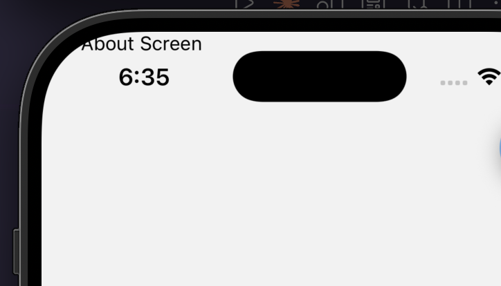
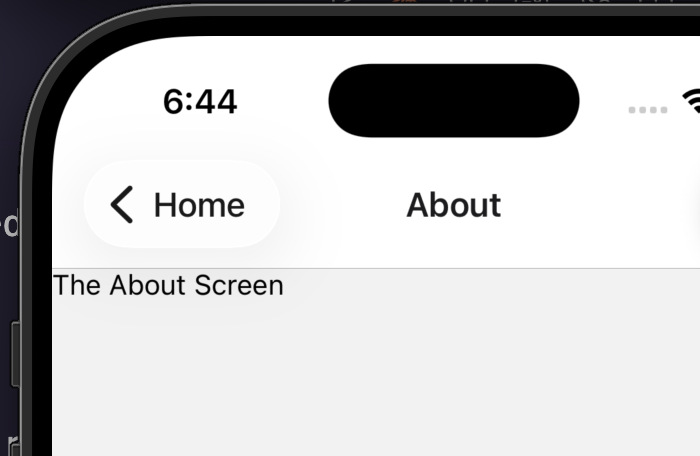

## How Navigation works

To navigate from one screen to another screen.<br>

```tsx
<View style={styles.container}>
  <Text style={styles.content}>Edit src/app/index.tsx to edit this screen</Text>
  <Link href="/about">Visit about screen</Link>
</View>
```

This will navigate to the about screen.<br>

## Stack in Layout

The reason we have the stack like navigation is we used the `Stack` component in the root layout.

```tsx
import { Stack } from "expo-router"

export default function RootLayout() {
  return <Stack />
}
```

<br>
There is a browser-tab like name above the view/window where the name of the view is written. If you want to get rid of this, add the following prop to the `Stack` component:

```tsx
<Stack screenOptions={{ headerShown: false }} />
```

The only problem it has is the view content overflows the curved edges.<br>

<br><br>

Let's say you want to have the tab title but specific to the screen and your way:

```tsx
export default function RootLayout() {
  return (
    <Stack>
      <Stack.Screen name="index" options={{ title: "Home" }} />
      <Stack.Screen name="about" options={{ title: "About" }} />
    </Stack>
  )
}
```

<br>

## Tab Navigator

A tab navigator in react native is a navigation pattern that creates a tab bar (usually at the bottom of the screen) allowing users to switch between screens.
